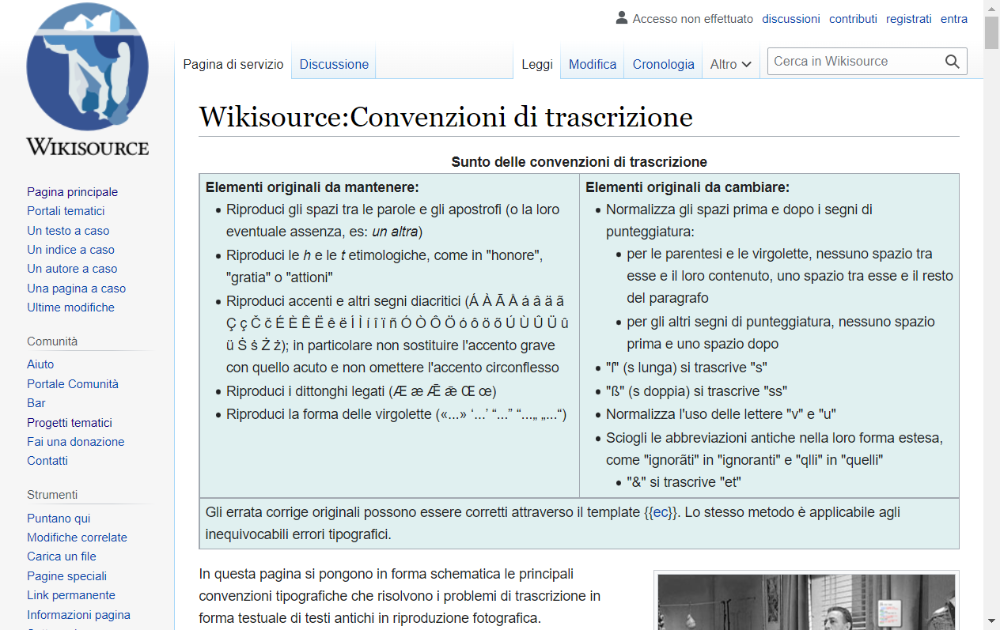

# Random Wikipedia walker

Using Selenium, create a small program that, starting from the main page https://www.wikipedia.org/, walks trough a sequence of random links and takes a snapshot of the last page.
The process is as follows:

 1. Navigate to the main page https://www.wikipedia.org/
 2. Select a random link in the page
 3. Navigate to the link
 4. Repeat steps 2 to 3 until you have visited 10 different pages
 5. Take a snapshot of the current page and save it

Include the code of the walker and the snapshot in this document.

## Answer

**Test Selenium - java sous intelliJ :**
```java
import io.github.bonigarcia.wdm.WebDriverManager;
import org.apache.commons.io.FileUtils;
import org.junit.jupiter.api.BeforeAll;
import org.junit.jupiter.api.Test;
import org.openqa.selenium.*;
import org.openqa.selenium.chrome.ChromeDriver;

import java.io.File;
import java.io.IOException;
import java.util.HashSet;
import java.util.List;
import java.util.Random;
import java.util.Set;

public class TestSelenium {

    private static WebDriver webDriver;
    private static Set<String> listPages;
    private static String lastUrl;
    private static String newUrl;

    @BeforeAll
    public static void setUp(){

        listPages = new HashSet<>();

        lastUrl = "";

        newUrl = "";

        System.setProperty("webdriver.chrome.driver", "C:\\Users\\Erwann\\chromedriver_win32\\chromedriver.exe");

        WebDriverManager.chromedriver().setup();

        webDriver = new ChromeDriver();

        // Setting the browser size
        webDriver.manage().window().setSize(new Dimension(1024, 768));
    }

    @Test
    public void testRandomNavigate(){
        // Go to wikipedia
        newUrl = "https://en.wikipedia.org/";
        webDriver.navigate().to(newUrl);

        // Random number
        Random rand = new Random();

        while (listPages.size() < 10){
            try{
                List<WebElement> allLinks = webDriver.findElements(By.tagName("a"));
                if(!allLinks.isEmpty()){
                    int randomNumber = rand.nextInt(allLinks.size() - 0 + 1) + 0;
                    WebElement randomElement = allLinks.get(randomNumber);
                    String url = randomElement.getAttribute("href");
                    randomElement.click();
                    listPages.add(url);
                    lastUrl = newUrl;
                    newUrl = url;
                }else{
                    webDriver.navigate().to(lastUrl);
                    newUrl = lastUrl;
                }
            }catch(ElementNotInteractableException e){
                System.out.println("Element not interactable");
            }
        }

        // Take screenshot
        File scrFile = ((TakesScreenshot)webDriver).getScreenshotAs(OutputType.FILE);
        try {
            FileUtils.copyFile(scrFile, new File("C:\\Users\\Erwann\\Desktop\\M2 CCNa\\VV\\screenshot.png"));
        } catch (IOException e) {
            e.printStackTrace();
        }
        webDriver.quit();
    }
}
```

**Screenshot de la 10ème page :**



